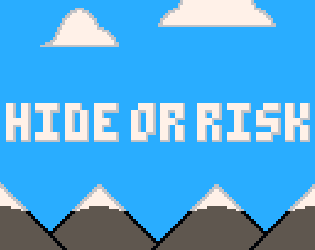
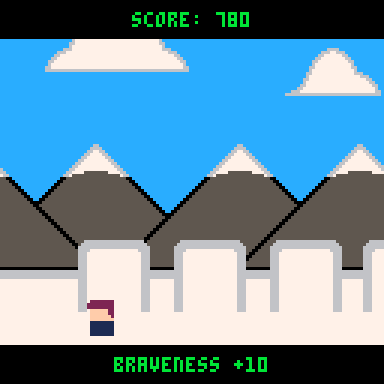
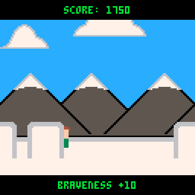

# Hide or Risk 2

This game is a remake of my first game **Hide or Risk**.

The principle of the game is to hide from the eyes of the catcher. This can only be achieved by reaching the blocks and good timing.

 

This new version is compatible with the fantasy console PICO-8 and brings a few new rules:

-   It is now possible to partially run back for points
-   You don't lose any more points when you click a button again
-   The higher the score, the greater the difficulty

Play it now on [itch.io](https://peanutsfly.itch.io/hide-or-risk-2) or the [Lexaloffle Forum](https://www.lexaloffle.com/bbs/?tid=41848).

The [PICO-8 Fantasy Console](https://www.lexaloffle.com/pico-8.php) is required to compile the game yourself.

## How to play:

-   Start your game by pressing X/C
-   Press left or right to move.
-   Get points for steps to the right. Lose on steps to the left.
-   Hide behind blocks and don't get caught.

## Credits:

-   Music: Dimensional Gate by @gruber_music
-   Art, Programming, Sounds: Made by PeanutsFly

## Additional Information:

-   Status: Released
-   Platforms: Windows, macOS, Linux, HTML5
-   Author: PeanutsFly
-   Genre: Action
-   Made with PICO-8, Aseprite
-   Tags: 2D, Casual, Colorful, Endless, infinite-runner, Minimalist, PICO-8, Pixel Art, Procedural Generation, Short
-   Average session: A few seconds
-   Languages: English
-   Inputs: Keyboard
